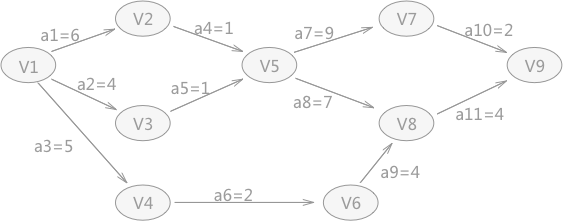

在学习[拓扑排序](http://c.biancheng.net/view/vip_3416.html)一节时讲到拓扑排序只适用于 AOV 网，本节所介绍的求关键路径针对的是和 AOV 网相近的 AOE 网。

## 什么是AOE网

AOE 网是在 AOV 网的基础上，其中每一个边都具有各自的权值，是一个有向无环网。其中权值表示活动持续的时间。


								图 1 AOE网

如图 1 所示就是一个 AOE 网，例如 a1=6 表示完成 a1 活动完成需要 6 天；AOE 网中每个顶点表示在它之前的活动已经完成，可以开始后边的活动，例如 V5 表示 a4 和 a5 活动已经完成，a7 和 a8 可以开始。

使用 AOE 网可以帮助解决这样的问题：<font color="red">如果将 AOE 网看做整个项目，那么完成整个项目至少需要多少时间？</font>

解决这个问题的关键在于从 AOE 网中找到一条从起始点到结束点长度最长的路径，这样就能保证所有的活动在结束之前都能完成。

> 起始点是入度为 0 的点，称为“源点”；结束点是出度为 0 的点，称为“汇点”。这条最长的路径，被称为”关键路径“。

为了求出一个给定 AOE 网的关键路径，需要知道以下 4 个统计数据：

- 对于 AOE 网中的**顶点**有两个时间：**最早发生时间（用 Ve(j) 表示）**和**最晚发生时间（用 Vl(j) 表示）**；
- 对于**边**来说，也有两个时间：**最早开始时间（用 e(i) 表示）**和**最晚开始时间（ l(i) 表示）**。


<font color="green">Ve(j)</font>：对于 AOE 网中的任意一个顶点来说，从源点到该点的最长路径代表着该顶点的最早发生时间，通常用 Ve(j) 表示。

例如，图 1 中从 V1 到 V5 有两条路径，V1 作为源点开始后，a1 和 a2 同时开始活动，但由于 a1 和 a2 活动的时间长度不同，最终 V1-V3-V5 的这条路径率先完成。但是并不是说 V5 之后的活动就可以开始，而是需要等待 V1-V2-V5 这条路径也完成之后才能开始。所以对于 V5 来讲，Ve(5) = 7。


<font color="green">Vl(j)</font>：表示在不推迟整个工期的前提下，事件 Vk 允许的最晚发生时间。

例如，图 1 中，在得知整个工期完成的时间是 18 天的前提下，V7 最晚要在第 16 天的时候开始，因为 a10 活动至少需要 2 天时间才能完成，如果在 V7 事件在推迟，就会拖延整个工期。所以，对于 V7 来说，它的 Vl(7)=16。


<font color="green">e(i)</font>：表示活动 ai 的最早开始时间，如果活动 ai 是由弧 <Vk,Vj> 表示的，那么活动 ai 的最早开始的时间就等于时间 Vk 的最早发生时间，也就是说：e[i] = ve[k]。

e(i)很好理解，拿图 1 中 a4 来说，如果 a4 想要开始活动，那么首先前提就是 V2 事件开始。所以 e[4]=ve[2]。


<font color="green">l(i)</font>：表示活动 ai 的最晚开始时间，如果活动 ai 是由弧 <Vk,Vj> 表示，ai 的最晚开始时间的设定要保证 Vj 的最晚发生时间不拖后。所以，l[i]=Vl[j]-len<Vk,Vj>。

在得知以上四种统计数据后，就可以直接求得 AOE 网中关键路径上的所有的关键活动，方法是：对于所有的边来说，如果它的最早开始时间等于最晚开始时间，称这条边所代表的活动为关键活动。由关键活动构成的路径为关键路径。

## AOE网求关键路径实现过程

对图 1 中的 AOE 图求关键路径，首先完成 Ve(j)、Vl(j)、e(i)、l(i) 4 种统计信息的准备工作。

Ve(j)，求出从源点到各顶点的最长路径长度为（长度最大的）：


Vl(j)，求出各顶点的最晚发生时间（从后往前推，多种情况下选择最小的）：


e(i)，求出各边中ai活动的最早开始时间：


l(i),求各边中ai活动的最晚开始时间（多种情况下，选择最小的）：


通过对比 l(i) 和 e(i) ，其中 a1 、 a4 、 a7 、 a8 、 a10 、 a11 的值都各自相同，所以，在图 1 中的 AOE 网中有两条关键路径：


								图 2 关键路径


AOE 网计算关键路径的 C 语言代码实现为：

```c
#include <stdio.h>
#include <stdlib.h>
#define  MAX_VERTEX_NUM 20//最大顶点个数
#define  VertexType int//顶点数据的类型
typedef enum{false,true} bool;
//建立全局变量，保存边的最早开始时间
VertexType ve[MAX_VERTEX_NUM];
//建立全局变量，保存边的最晚开始时间
VertexType vl[MAX_VERTEX_NUM];
typedef struct ArcNode{
    int adjvex;//邻接点在数组中的位置下标
    struct ArcNode * nextarc;//指向下一个邻接点的指针
    VertexType dut;
}ArcNode;

typedef struct VNode{
    VertexType data;//顶点的数据域
    ArcNode * firstarc;//指向邻接点的指针
}VNode,AdjList[MAX_VERTEX_NUM];//存储各链表头结点的数组

typedef struct {
    AdjList vertices;//图中顶点及各邻接点数组
    int vexnum,arcnum;//记录图中顶点数和边或弧数
}ALGraph;
//找到顶点对应在邻接表数组中的位置下标
int LocateVex(ALGraph G,VertexType u){
    for (int i=0; i<G.vexnum; i++) {
        if (G.vertices[i].data==u) {
            return i;
        }
    }
    return -1;
}
//创建AOE网，构建邻接表
void CreateAOE(ALGraph **G){
    *G=(ALGraph*)malloc(sizeof(ALGraph));
   
    scanf("%d,%d",&((*G)->vexnum),&((*G)->arcnum));
    for (int i=0; i<(*G)->vexnum; i++) {
        scanf("%d",&((*G)->vertices[i].data));
        (*G)->vertices[i].firstarc=NULL;
    }
    VertexType initial,end,dut;
    for (int i=0; i<(*G)->arcnum; i++) {
        scanf("%d,%d,%d",&initial,&end,&dut);
       
        ArcNode *p=(ArcNode*)malloc(sizeof(ArcNode));
        p->adjvex=LocateVex(*(*G), end);
        p->nextarc=NULL;
        p->dut=dut;
       
        int locate=LocateVex(*(*G), initial);
        p->nextarc=(*G)->vertices[locate].firstarc;
        (*G)->vertices[locate].firstarc=p;
    }
}
//结构体定义栈结构
typedef struct stack{
    VertexType data;
    struct stack * next;
}stack;

stack *T;

//初始化栈结构
void initStack(stack* *S){
    (*S)=(stack*)malloc(sizeof(stack));
    (*S)->next=NULL;
}
//判断栈是否为空
bool StackEmpty(stack S){
    if (S.next==NULL) {
        return true;
    }
    return false;
}
//进栈，以头插法将新结点插入到链表中
void push(stack *S,VertexType u){
    stack *p=(stack*)malloc(sizeof(stack));
    p->data=u;
    p->next=NULL;
    p->next=S->next;
    S->next=p;
}
//弹栈函数，删除链表首元结点的同时，释放该空间，并将该结点中的数据域通过地址传值给变量i;
void pop(stack *S,VertexType *i){
    stack *p=S->next;
    *i=p->data;
    S->next=S->next->next;
    free(p);
}
//统计各顶点的入度
void FindInDegree(ALGraph G,int indegree[]){
    //初始化数组，默认初始值全部为0
    for (int i=0; i<G.vexnum; i++) {
        indegree[i]=0;
    }
    //遍历邻接表，根据各链表中结点的数据域存储的各顶点位置下标，在indegree数组相应位置+1
    for (int i=0; i<G.vexnum; i++) {
        ArcNode *p=G.vertices[i].firstarc;
        while (p) {
            indegree[p->adjvex]++;
            p=p->nextarc;
        }
    }
}

bool TopologicalOrder(ALGraph G){
    int indegree[G.vexnum];//创建记录各顶点入度的数组
    FindInDegree(G,indegree);//统计各顶点的入度
    //建立栈结构，程序中使用的是链表
    stack *S;
    //初始化栈
    initStack(&S);
    for (int i=0; i<G.vexnum; i++) {
        ve[i]=0;
    }
    //查找度为0的顶点，作为起始点
    for (int i=0; i<G.vexnum; i++) {
        if (!indegree[i]) {
            push(S, i);
        }
    }
    int count=0;
    //栈为空为结束标志
    while (!StackEmpty(*S)) {
        int index;
        //弹栈，并记录栈中保存的顶点所在邻接表数组中的位置
        pop(S,&index);
        //压栈，为求各边的最晚开始时间做准备
        push(T, index);
        ++count;
        //依次查找跟该顶点相链接的顶点，如果初始入度为1，当删除前一个顶点后，该顶点入度为0
        for (ArcNode *p=G.vertices[index].firstarc; p ; p=p->nextarc) {
           
            VertexType k=p->adjvex;
           
            if (!(--indegree[k])) {
                //顶点入度为0，入栈
                push(S, k);
            }
            //如果边的源点的最长路径长度加上边的权值比汇点的最长路径长度还长，就覆盖ve数组中对应位置的值，最终结束时，ve数组中存储的就是各顶点的最长路径长度。
            if (ve[index]+p->dut>ve[k]) {
                ve[k]=ve[index]+p->dut;
            }
        }
    }
    //如果count值小于顶点数量，表明有向图有环
    if (count<G.vexnum) {
        printf("该图有回路");
        return false;
    }
    return true;
}
//求各顶点的最晚发生时间并计算出各边的最早和最晚开始时间
void CriticalPath(ALGraph G){
    if (!TopologicalOrder(G)) {
        return ;
    }
    for (int i=0 ; i<G.vexnum ; i++) {
        vl[i]=ve[G.vexnum-1];
    }
    int j,k;
    while (!StackEmpty(*T)) {
        pop(T, &j);
        for (ArcNode* p=G.vertices[j].firstarc ; p ; p=p->nextarc) {
            k=p->adjvex;
            //构建Vl数组，在初始化时，Vl数组中每个单元都是18，如果每个边的汇点-边的权值比源点值小，就保存更小的。
            if (vl[k]-p->dut<vl[j]) {
                vl[j] = vl[k]-p->dut;
            }
        }
    }
    for (j = 0; j < G.vexnum; j++) {
        for (ArcNode*p = G.vertices[j].firstarc; p ;p = p->nextarc) {
            k = p->adjvex;
            //求各边的最早开始时间e[i],等于ve数组中相应源点存储的值
            int ee = ve[j];
            //求各边的最晚开始时间l[i]，等于汇点在vl数组中存储的值减改边的权值
            int el = vl[k]-p->dut;
            //判断e[i]和l[i]是否相等，如果相等，该边就是关键活动，相应的用*标记；反之，边后边没标记
            char tag = (ee==el)?'*':' ';
            printf("%3d%3d%3d%3d%3d%2c\n",j,k,p->dut,ee,el,tag);
        }
    }
}
int main(){
    ALGraph *G;
    CreateAOE(&G);//创建AOE网
    initStack(&T);
    TopologicalOrder(*G);
    CriticalPath(*G);
    return  0;
}
```

拿图 1 中的 AOE 网为例，运行的结果为：

```
9,11
1
2
3
4
5
6
7
8
9
1,2,6
1,3,4
1,4,5
2,5,1
3,5,1
4,6,2
5,7,9
5,8,7
6,8,4
7,9,2
8,9,4
 0 3 5 0 3 
 0 2 4 0 2 
 0 1 6 0 0 *
 1 4 1 6 6 *
 2 4 1 4 6 
 3 5 2 5 8 
 4 7 7 7 7 *
 4 6 9 7 7 *
 5 7 4 7 10 
 6 8 2 16 16 *
 7 8 4 14 14 *
```


通过运行结果，可以看出关键活动有 6 个（后面带有 * 号的），而组成的关键路径就如图 2 中所示。